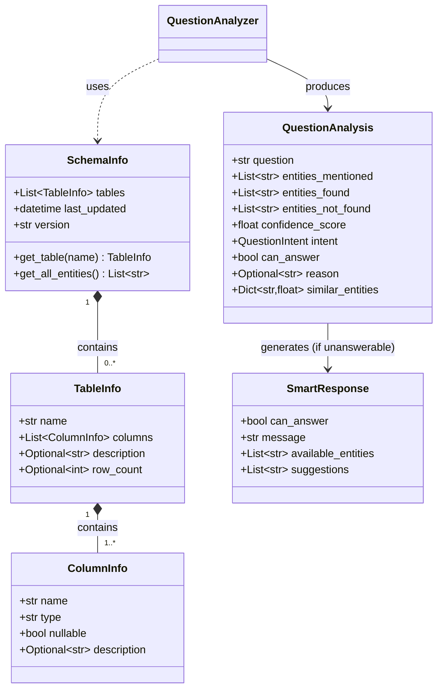
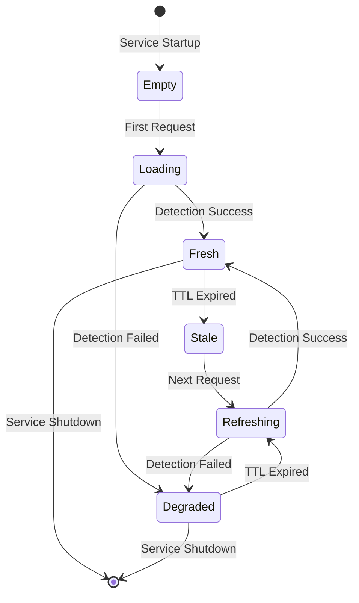

# Data Model: Smart Response Detection
## Feature 003

**Date**: 2024-11-26  
**Status**: Complete  
**Purpose**: Define all domain entities and their relationships for smart response detection

---

## Model Overview



---

## Core Models

### 1. SchemaInfo

**Purpose**: Represents complete database schema metadata cached in memory.

**File**: `apps/backend-fastapi/src/domain/schema_info.py`

```python
from __future__ import annotations
from datetime import datetime
from typing import List, Optional
from pydantic import BaseModel, Field


class SchemaInfo(BaseModel):
    """Complete database schema metadata."""
    
    tables: List[TableInfo] = Field(
        description="All database tables in the public schema"
    )
    last_updated: datetime = Field(
        description="Timestamp when schema was last refreshed from database"
    )
    version: str = Field(
        default="1.0.0",
        description="Schema version identifier (for cache invalidation)"
    )
    
    # Computed properties
    @property
    def table_count(self) -> int:
        """Total number of tables."""
        return len(self.tables)
    
    @property
    def total_columns(self) -> int:
        """Total number of columns across all tables."""
        return sum(len(table.columns) for table in self.tables)
    
    # Methods
    def get_table(self, name: str) -> Optional[TableInfo]:
        """Find table by name (case-insensitive).
        
        Args:
            name: Table name to search for
            
        Returns:
            TableInfo if found, None otherwise
        """
        name_lower = name.lower()
        for table in self.tables:
            if table.name.lower() == name_lower:
                return table
        return None
    
    def get_all_entities(self) -> List[str]:
        """Get all table names as potential entities.
        
        Returns:
            List of table names in original case
        """
        return [table.name for table in self.tables]
    
    def get_all_columns(self) -> List[str]:
        """Get all column names in 'table.column' format.
        
        Returns:
            List of fully qualified column names
        """
        result = []
        for table in self.tables:
            for column in table.columns:
                result.append(f"{table.name}.{column.name}")
        return result
    
    def find_similar_tables(self, term: str, threshold: float = 0.70) -> List[tuple[str, float]]:
        """Find tables with names similar to the given term.
        
        Args:
            term: Search term
            threshold: Minimum similarity score (0.0 to 1.0)
            
        Returns:
            List of (table_name, similarity_score) tuples, sorted by score descending
        """
        from difflib import SequenceMatcher
        
        results = []
        term_lower = term.lower()
        
        for table in self.tables:
            score = SequenceMatcher(None, term_lower, table.name.lower()).ratio()
            if score >= threshold:
                results.append((table.name, score))
        
        return sorted(results, key=lambda x: x[1], reverse=True)
    
    class Config:
        json_schema_extra = {
            "example": {
                "tables": [
                    {
                        "name": "leitos",
                        "columns": [
                            {"name": "id", "type": "integer", "nullable": False},
                            {"name": "numero", "type": "varchar", "nullable": False},
                            {"name": "status", "type": "varchar", "nullable": True}
                        ],
                        "description": "Hospital beds and their status",
                        "row_count": 150
                    }
                ],
                "last_updated": "2024-11-26T10:00:00Z",
                "version": "1.0.0"
            }
        }
```

---

### 2. TableInfo

**Purpose**: Represents metadata for a single database table.

**File**: `apps/backend-fastapi/src/domain/schema_info.py` (same file)

```python
class TableInfo(BaseModel):
    """Metadata for a single database table."""
    
    name: str = Field(
        description="Table name as it appears in the database"
    )
    columns: List[ColumnInfo] = Field(
        description="All columns in this table",
        min_length=1  # Table must have at least one column
    )
    description: Optional[str] = Field(
        default=None,
        description="Table description from PostgreSQL comments (if available)"
    )
    row_count: Optional[int] = Field(
        default=None,
        description="Approximate number of rows (cached, may be stale)",
        ge=0
    )
    
    # Computed properties
    @property
    def column_count(self) -> int:
        """Number of columns in this table."""
        return len(self.columns)
    
    @property
    def nullable_columns(self) -> List[str]:
        """Names of columns that allow NULL."""
        return [col.name for col in self.columns if col.nullable]
    
    @property
    def numeric_columns(self) -> List[str]:
        """Names of numeric columns (for aggregation suggestions)."""
        numeric_types = {"integer", "bigint", "smallint", "decimal", "numeric", "real", "double precision"}
        return [col.name for col in self.columns if col.type.lower() in numeric_types]
    
    # Methods
    def get_column(self, name: str) -> Optional[ColumnInfo]:
        """Find column by name (case-insensitive).
        
        Args:
            name: Column name to search for
            
        Returns:
            ColumnInfo if found, None otherwise
        """
        name_lower = name.lower()
        for column in self.columns:
            if column.name.lower() == name_lower:
                return column
        return None
    
    def has_status_column(self) -> bool:
        """Check if table has a column indicating status/state."""
        status_keywords = {"status", "estado", "situacao", "ativo"}
        for column in self.columns:
            if any(keyword in column.name.lower() for keyword in status_keywords):
                return True
        return False
    
    class Config:
        json_schema_extra = {
            "example": {
                "name": "atendimentos",
                "columns": [
                    {"name": "id", "type": "integer", "nullable": False},
                    {"name": "paciente_id", "type": "integer", "nullable": False},
                    {"name": "data", "type": "date", "nullable": False},
                    {"name": "valor", "type": "decimal", "nullable": True}
                ],
                "description": "Patient appointments and consultations",
                "row_count": 5420
            }
        }
```

---

### 3. ColumnInfo

**Purpose**: Represents metadata for a single database column.

**File**: `apps/backend-fastapi/src/domain/schema_info.py` (same file)

```python
class ColumnInfo(BaseModel):
    """Metadata for a single database column."""
    
    name: str = Field(
        description="Column name as it appears in the database"
    )
    type: str = Field(
        description="PostgreSQL data type (e.g., 'integer', 'varchar', 'timestamp')"
    )
    nullable: bool = Field(
        description="Whether column allows NULL values"
    )
    description: Optional[str] = Field(
        default=None,
        description="Column description from PostgreSQL comments (if available)"
    )
    
    @property
    def is_numeric(self) -> bool:
        """Check if column is numeric type."""
        numeric_types = {"integer", "bigint", "smallint", "decimal", "numeric", "real", "double precision"}
        return self.type.lower() in numeric_types
    
    @property
    def is_text(self) -> bool:
        """Check if column is text type."""
        text_types = {"varchar", "text", "char", "character varying"}
        return self.type.lower() in text_types or self.type.lower().startswith("varchar")
    
    @property
    def is_temporal(self) -> bool:
        """Check if column is date/time type."""
        temporal_types = {"date", "timestamp", "time", "interval", "timestamptz"}
        return self.type.lower() in temporal_types or "timestamp" in self.type.lower()
    
    class Config:
        json_schema_extra = {
            "example": {
                "name": "created_at",
                "type": "timestamp with time zone",
                "nullable": False,
                "description": "Record creation timestamp"
            }
        }
```

---

## Analysis Models

### 4. QuestionAnalysis

**Purpose**: Result of analyzing a user question to determine if it can be answered.

**File**: `apps/backend-fastapi/src/domain/question_analysis.py`

```python
from __future__ import annotations
from enum import Enum
from typing import Dict, List, Optional
from pydantic import BaseModel, Field, field_validator


class QuestionIntent(str, Enum):
    """Detected intent of the user's question."""
    COUNT = "count"                # "Quantos X existem?"
    LIST = "list"                  # "Quais X estão cadastrados?"
    AGGREGATE = "aggregate"        # "Qual a média de X?"
    FILTER = "filter"              # "Mostre X onde Y"
    STATUS = "status"              # "Qual o estado de X?"
    COMPARISON = "comparison"      # "Compare X com Y"
    UNKNOWN = "unknown"            # Cannot determine intent


class QuestionAnalysis(BaseModel):
    """Result of analyzing a user question."""
    
    question: str = Field(
        description="Original question text from user"
    )
    entities_mentioned: List[str] = Field(
        description="Entities (nouns) extracted from question after stop word removal"
    )
    entities_found_in_schema: List[str] = Field(
        description="Entities that exist in database schema (exact or close match)"
    )
    entities_not_found: List[str] = Field(
        description="Entities that do NOT exist in database schema"
    )
    confidence_score: float = Field(
        description="Confidence that question can be answered (0.0 to 1.0)",
        ge=0.0,
        le=1.0
    )
    intent: QuestionIntent = Field(
        default=QuestionIntent.UNKNOWN,
        description="Detected intent of the question"
    )
    can_answer: bool = Field(
        description="Whether system believes it can answer this question"
    )
    reason: Optional[str] = Field(
        default=None,
        description="Explanation if question cannot be answered"
    )
    similar_entities: Dict[str, float] = Field(
        default_factory=dict,
        description="Near-match entities with similarity scores (0.0 to 1.0)"
    )
    synonym_mappings: Dict[str, str] = Field(
        default_factory=dict,
        description="Synonyms that were mapped (e.g., 'camas' -> 'leitos')"
    )
    
    @field_validator("confidence_score")
    @classmethod
    def validate_confidence(cls, v: float) -> float:
        """Ensure confidence is between 0 and 1."""
        if not 0.0 <= v <= 1.0:
            raise ValueError("Confidence score must be between 0.0 and 1.0")
        return round(v, 3)  # Round to 3 decimal places
    
    @property
    def is_partial_match(self) -> bool:
        """Check if some entities found but others not found."""
        return len(self.entities_found_in_schema) > 0 and len(self.entities_not_found) > 0
    
    @property
    def match_ratio(self) -> float:
        """Ratio of found entities to total entities."""
        total = len(self.entities_mentioned)
        if total == 0:
            return 0.0
        found = len(self.entities_found_in_schema)
        return round(found / total, 3)
    
    class Config:
        json_schema_extra = {
            "example": {
                "question": "Quantas camas estão disponíveis?",
                "entities_mentioned": ["camas", "disponíveis"],
                "entities_found_in_schema": ["leitos"],
                "entities_not_found": [],
                "confidence_score": 0.85,
                "intent": "count",
                "can_answer": True,
                "reason": None,
                "similar_entities": {"leitos": 0.75},
                "synonym_mappings": {"camas": "leitos"}
            }
        }
```

---

### 5. SmartResponse

**Purpose**: Response structure when question cannot be answered.

**File**: `apps/backend-fastapi/src/domain/question_analysis.py` (same file)

```python
class SmartResponse(BaseModel):
    """Response for questions that cannot be answered with available data."""
    
    can_answer: bool = Field(
        default=False,
        description="Always False for smart responses (indicates rejection)"
    )
    message: str = Field(
        description="Clear explanation of why question cannot be answered"
    )
    available_entities: List[str] = Field(
        description="Data categories that ARE available in the database"
    )
    suggestions: List[str] = Field(
        description="Alternative questions that CAN be answered",
        min_length=3,
        max_length=3
    )
    partial_match: bool = Field(
        default=False,
        description="True if some entities found but others not found"
    )
    found_entities: List[str] = Field(
        default_factory=list,
        description="Entities that WERE found (for partial matches)"
    )
    
    @field_validator("suggestions")
    @classmethod
    def validate_suggestions(cls, v: List[str]) -> List[str]:
        """Ensure exactly 3 suggestions."""
        if len(v) != 3:
            raise ValueError("Must provide exactly 3 suggestions")
        return v
    
    def format_for_streaming(self) -> List[str]:
        """Format response as list of SSE messages.
        
        Returns:
            List of strings to be sent as SSE data events
        """
        messages = []
        
        if self.partial_match:
            messages.append(f"⚠️ {self.message}")
            if self.found_entities:
                messages.append(f"✓ Entidades encontradas: {', '.join(self.found_entities)}")
        else:
            messages.append(f"✗ {self.message}")
        
        messages.append(f"✓ Informações disponíveis: {', '.join(self.available_entities)}")
        messages.append("✓ Sugestões:")
        for suggestion in self.suggestions:
            messages.append(f"  • {suggestion}")
        
        return messages
    
    class Config:
        json_schema_extra = {
            "example": {
                "can_answer": False,
                "message": "A informação sobre 'protocolos de isolamento' não está disponível no sistema",
                "available_entities": ["leitos", "atendimentos", "especialidades", "procedimentos"],
                "suggestions": [
                    "Quantos leitos estão disponíveis?",
                    "Qual a ocupação da UTI?",
                    "Quais especialidades estão cadastradas?"
                ],
                "partial_match": False,
                "found_entities": []
            }
        }
```

---

## Supporting Models

### 6. EntityMatch

**Purpose**: Internal model for entity matching results.

**File**: `apps/backend-fastapi/src/services/question_analyzer_service.py` (internal use)

```python
from dataclasses import dataclass
from typing import Optional

@dataclass
class EntityMatch:
    """Result of matching an entity against schema."""
    
    entity: str                      # Original entity from question
    matched_table: Optional[str]     # Table name if match found
    match_type: str                  # "exact", "partial", "similar", "none"
    similarity_score: float          # 0.0 to 1.0
    synonym_used: Optional[str]      # Synonym that was mapped (if any)
```

---

## State Transitions

### Schema Cache Lifecycle



**States**:
- **Empty**: No schema cached yet
- **Loading**: First schema detection in progress
- **Fresh**: Cache valid, within TTL
- **Stale**: Cache expired, needs refresh
- **Refreshing**: Background refresh in progress
- **Degraded**: Detection failed, using stale cache

---

## Relationships

### Entity Relationships

```
SchemaInfo (1) ━━━ (0..*) TableInfo
TableInfo (1) ━━━ (1..*) ColumnInfo
QuestionAnalysis (0..*) ━━━ (1) SchemaInfo [references]
SmartResponse (0..*) ━━━ (1) QuestionAnalysis [generated from]
```

### Service Dependencies

```
SchemaDetectorService → SchemaInfo
QuestionAnalyzerService → SchemaInfo, QuestionAnalysis
SuggestionGeneratorService → SchemaInfo, SmartResponse
SQLAgentService → QuestionAnalyzerService
ChatRoute → SuggestionGeneratorService
```

---

## JSON Examples

### Complete SchemaInfo Example

```json
{
  "tables": [
    {
      "name": "leitos",
      "columns": [
        {"name": "id", "type": "integer", "nullable": false},
        {"name": "numero", "type": "varchar", "nullable": false},
        {"name": "status", "type": "varchar", "nullable": true, "description": "disponível, ocupado, manutenção"}
      ],
      "description": "Leitos hospitalares",
      "row_count": 150
    },
    {
      "name": "atendimentos",
      "columns": [
        {"name": "id", "type": "integer", "nullable": false},
        {"name": "paciente_id", "type": "integer", "nullable": false},
        {"name": "leito_id", "type": "integer", "nullable": true},
        {"name": "data", "type": "date", "nullable": false},
        {"name": "valor", "type": "decimal", "nullable": true}
      ],
      "description": "Atendimentos e consultas",
      "row_count": 5420
    }
  ],
  "last_updated": "2024-11-26T14:30:00Z",
  "version": "1.0.0"
}
```

### Complete QuestionAnalysis Example (Unanswerable)

```json
{
  "question": "Qual protocolo aplicar para isolamento?",
  "entities_mentioned": ["protocolo", "isolamento"],
  "entities_found_in_schema": [],
  "entities_not_found": ["protocolo", "isolamento"],
  "confidence_score": 0.0,
  "intent": "filter",
  "can_answer": false,
  "reason": "Nenhuma das entidades mencionadas foi encontrada no schema do banco de dados",
  "similar_entities": {},
  "synonym_mappings": {}
}
```

### Complete SmartResponse Example

```json
{
  "can_answer": false,
  "message": "A informação sobre 'protocolos de isolamento' não está disponível no sistema",
  "available_entities": ["leitos", "atendimentos", "especialidades", "procedimentos"],
  "suggestions": [
    "Quantos leitos estão disponíveis?",
    "Qual a ocupação da UTI?",
    "Quais especialidades estão cadastradas?"
  ],
  "partial_match": false,
  "found_entities": []
}
```

---

## Validation Rules

### SchemaInfo
- ✅ Must have at least 1 table
- ✅ `last_updated` must be valid datetime
- ✅ `version` follows semver format (informational)

### TableInfo
- ✅ `name` must not be empty
- ✅ Must have at least 1 column
- ✅ `row_count` must be >= 0 if provided

### ColumnInfo
- ✅ `name` and `type` must not be empty
- ✅ `nullable` is always boolean (not null)

### QuestionAnalysis
- ✅ `confidence_score` must be between 0.0 and 1.0
- ✅ If `can_answer` is False, `reason` should be provided
- ✅ `entities_found` + `entities_not_found` should equal `entities_mentioned`

### SmartResponse
- ✅ `can_answer` must always be False
- ✅ Must have exactly 3 suggestions
- ✅ `available_entities` must not be empty
- ✅ If `partial_match` is True, `found_entities` must not be empty

---

**Data Model Status**: ✅ COMPLETE  
**Next**: Phase 1.2 - API Contract Design

